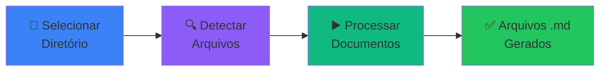

<div align="center">

# 📄 OCR Pipeline

### Extraia texto de imagens e PDFs com reconhecimento óptico inteligente

[](https://www.python.org/)
[](https://flet.dev/)
[](https://github.com/tesseract-ocr/tesseract)
[](LICENSE)

[](https://www.microsoft.com/windows)
[](https://www.linux.org/)
[](https://github.com/filipeabraaodasilva/ocr/stargazers)
[](https://github.com/filipeabraaodasilva/ocr/issues)

[🚀 Começar](#-instalação) • [📖 Documentação](#-como-usar) • [💡 Exemplos](#-exemplos) • [🐛 Reportar Bug](https://github.com/filipeabraaodasilva/ocr/issues)


*Interface moderna com tema escuro e processamento em tempo real*

---

</div>

## 🎯 Sobre

**OCR Pipeline** é uma solução moderna e intuitiva para digitalização de documentos. Transforme suas imagens e PDFs em texto editável com apenas alguns cliques, mantendo total privacidade com processamento 100% local.

<table>
<tr>
<td>

### ✨ Características

- 🖥️ Interface gráfica moderna e intuitiva
- 📁 Processamento em lote eficiente
- 🇧🇷 OCR otimizado para português
- 🧹 Limpeza automática de texto
- 📊 Progresso em tempo real
- 💾 Arquivos individuais organizados
- 🔒 100% local e privado

</td>
<td>

### 🎯 Ideal Para

- 📚 Digitalização de livros e documentos
- 🏢 Arquivamento corporativo
- 📄 Conversão de PDFs escaneados
- 📸 Extração de texto de fotos
- 🗂️ Organização de documentos
- 📋 Transcrição de formulários

</td>
</tr>
</table>

---

## 🚀 Instalação

<details open>
<summary><b>🪟 Windows</b> (clique para expandir)</summary>

<br>

### Passo 1: Python

```powershell
# Baixe e instale Python 3.12+ de python.org
# ⚠️ IMPORTANTE: Marque "Add Python to PATH" durante a instalação
```

<div align="center">
   →
   →
  
</div>

### Passo 2: Tesseract OCR

**Opção A - Chocolatey (Recomendado):**
```powershell
choco install tesseract
choco install tesseract-lang-por
```

**Opção B - Instalador Manual:**
```powershell
# 1. Baixe de: https://github.com/UB-Mannheim/tesseract/wiki
# 2. Execute o instalador
# 3. Baixe o pacote português: por.traineddata
# 4. Copie para: C:\Program Files\Tesseract-OCR\tessdata\
```

### Passo 3: Clone e Execute

```powershell
# Clone o repositório
git clone https://github.com/filipeabraaodasilva/ocr.git
cd ocr

# Crie o ambiente virtual
python -m venv .venv
.venv\Scripts\activate

# Instale as dependências
pip install -r requirements.txt

# Execute a aplicação
python main.py
```

<div align="center">

🎉 **Pronto!** A interface gráfica deve abrir automaticamente.

</div>

</details>

<details>
<summary><b>🐧 Linux</b> (clique para expandir)</summary>

<br>

### Ubuntu / Debian

```bash
# Instale as dependências do sistema
sudo apt-get update
sudo apt-get install -y tesseract-ocr tesseract-ocr-por python3.12 python3.12-venv git

# Clone o repositório
git clone https://github.com/filipeabraaodasilva/ocr.git
cd ocr

# Configure o ambiente
python3 -m venv .venv
source .venv/bin/activate
pip install -r requirements.txt

# Execute
python main.py
```

### Fedora / RHEL

```bash
sudo dnf install tesseract tesseract-langpack-por python3 python3-pip git
```

### Arch Linux

```bash
sudo pacman -S tesseract tesseract-data-por python python-pip git
```

</details>

---

## 📖 Como Usar

<div align="center">

### 🎬 Fluxo de Trabalho



</div>

<table>
<tr>
<td width="33%">

### 1️⃣ Selecione

<div align="center">
  
</div>

Clique em **"Selecionar Diretório"** e escolha a pasta com seus documentos.

</td>
<td width="33%">

### 2️⃣ Processe

<div align="center">
  
</div>

Clique em **"Processar Arquivos"** e aguarde o OCR extrair o texto.

</td>
<td width="33%">

### 3️⃣ Use

<div align="center">
  
</div>

Abra os arquivos **.md** gerados com o texto extraído!

</td>
</tr>
</table>

---

## 💡 Exemplos

### 📂 Antes do Processamento

```
📁 meus_documentos/
├── 📄 contrato.pdf
├── 📄 relatorio.pdf
└── 🖼️ foto_documento.jpg
```

### ✨ Depois do Processamento

```
📁 meus_documentos/
├── 📄 contrato.pdf
├── 📝 contrato.md              ← ✅ Texto extraído (150 KB)
├── 📄 relatorio.pdf
├── 📝 relatorio.md             ← ✅ Texto extraído (85 KB)
├── 🖼️ foto_documento.jpg
└── 📝 foto_documento.md        ← ✅ Texto extraído (42 KB)
```

### 📄 Formato do Arquivo Gerado

````markdown
# contrato.pdf

**Extraído em:** 03/03/2026 13:15:30

---

# CONTRATO DE PRESTAÇÃO DE SERVIÇOS

Este contrato é celebrado entre...

[Texto limpo, formatado e pronto para usar]
````

---

## 🎨 Formatos Suportados

<div align="center">

| Tipo | Formatos | Suporte |
|:----:|:---------|:-------:|
| 🖼️ **Imagens** | PNG, JPG, JPEG, GIF, BMP, TIFF, WEBP | ✅ |
| 📄 **PDFs** | PDF (nativos e escaneados) | ✅ |

</div>

---

## ⚙️ Processamento Automático

<table>
<tr>
<td width="50%">

### 🧹 Limpeza de Texto

- ✅ Remove caracteres de controle
- ✅ Elimina espaços extras
- ✅ Une palavras hifenizadas
- ✅ Corrige quebras de linha
- ✅ Normaliza pontuação
- ✅ Remove linhas vazias múltiplas

</td>
<td width="50%">

### 📊 Otimizações

- ⚡ Multi-threading
- 🚀 Processamento em lote
- 💾 Cache inteligente
- 🔄 Retomada automática
- 📈 Progresso em tempo real
- 🎯 Log detalhado

</td>
</tr>
</table>

---

## 💡 Dicas Pro

<div align="center">

### 🎯 Para Melhores Resultados

</div>

<table>
<tr>
<td align="center" width="25%">
  <br/>
  <b>Alta Resolução</b><br/>
  Mínimo 300 DPI
</td>
<td align="center" width="25%">
  <br/>
  <b>Boa Iluminação</b><br/>
  Evite sombras
</td>
<td align="center" width="25%">
  <br/>
  <b>Documento Reto</b><br/>
  Sem inclinação
</td>
<td align="center" width="25%">
  <br/>
  <b>Alto Contraste</b><br/>
  P&B preferencial
</td>
</tr>
</table>

---

## 🐛 Problemas Comuns

<details>
<summary><b>❌ Erro: "tesseract is not installed"</b></summary>

<br>

**Solução Windows:**
```powershell
# Verifique a instalação
tesseract --version

# Se não funcionar, adicione ao PATH:
# 1. Windows + R → sysdm.cpl
# 2. Avançado → Variáveis de Ambiente
# 3. Edite "Path" → Adicione: C:\Program Files\Tesseract-OCR
# 4. Reinicie o terminal
```

**Solução Linux:**
```bash
sudo apt-get install tesseract-ocr tesseract-ocr-por
```

</details>

<details>
<summary><b>❌ OCR não reconhece texto corretamente</b></summary>

<br>

**Checklist de qualidade:**
- [ ] Resolução mínima de 300 DPI
- [ ] Imagem bem iluminada
- [ ] Documento reto (sem rotação)
- [ ] Alto contraste
- [ ] Fonte legível (mínimo 10pt)
- [ ] Sem blur ou ruído excessivo

**Dica:** Edite a imagem antes do OCR usando ferramentas como GIMP ou Photoshop para melhorar qualidade.

</details>

<details>
<summary><b>❌ Processamento muito lento</b></summary>

<br>

**Otimizações:**
- 🔹 Processe em lotes de até 50 arquivos
- 🔹 Use SSD ao invés de HD
- 🔹 Feche outros programas pesados
- 🔹 Redimensione imagens grandes (máx 2000px largura)
- 🔹 Converta imagens coloridas para P&B antes

</details>

---

## 📦 Criar Executável

<div align="center">

### 🎁 Distribua sem Python

</div>

```powershell
# Windows
.venv\Scripts\activate
pip install -r requirements-build.txt
.\build.ps1

# Resultado: dist\OCR_Pipeline.exe (~100 MB)
```

```bash
# Linux
source .venv/bin/activate
pip install -r requirements-build.txt
./build.sh

# Resultado: dist/OCR_Pipeline (~80 MB)
```

> ⚠️ **Nota:** Tesseract OCR deve ser instalado separadamente pelos usuários finais.

---

## 🔒 Segurança & Privacidade

<div align="center">

<table>
<tr>
<td align="center" width="25%">
  <br/>
  <b>100% Local</b><br/>
  Sem envio de dados
</td>
<td align="center" width="25%">
  <br/>
  <b>Offline</b><br/>
  Sem internet necessária
</td>
<td align="center" width="25%">
  <br/>
  <b>Open Source</b><br/>
  Código auditável
</td>
<td align="center" width="25%">
  <br/>
  <b>Privado</b><br/>
  Seus dados são seus
</td>
</tr>
</table>

</div>

---

## 🤝 Contribuindo

<div align="center">

Contribuições são muito bem-vindas! 🎉

[](https://github.com/filipeabraaodasilva/ocr/graphs/contributors)

</div>

### Como Contribuir

1. 🍴 Fork o projeto
2. 🌿 Crie sua branch (`git checkout -b feature/MinhaFeature`)
3. ✅ Commit suas mudanças (`git commit -m 'Adiciona MinhaFeature'`)
4. 📤 Push para a branch (`git push origin feature/MinhaFeature`)
5. 🎯 Abra um Pull Request

### Áreas para Contribuir

- 🐛 Correção de bugs
- ✨ Novas features
- 📝 Melhorias na documentação
- 🌍 Traduções
- 🎨 Melhorias na interface
- ⚡ Otimizações de performance

---

## 📊 Estatísticas

<div align="center">


[](https://github.com/filipeabraaodasilva/ocr/commits)
[](https://github.com/filipeabraaodasilva/ocr/commits)
[](https://github.com/filipeabraaodasilva/ocr)

</div>

---

## 📄 Licença

<div align="center">

Este projeto está licenciado sob a **Licença MIT** - veja o arquivo [LICENSE](LICENSE) para detalhes.

```
MIT License - Livre para usar, modificar e distribuir
```

</div>

---

## 🙏 Agradecimentos

<div align="center">

Agradecimentos especiais a:

[](https://github.com/tesseract-ocr/tesseract)
[](https://flet.dev/)
[](https://python-pillow.org/)
[](https://github.com/microsoft/markitdown)

</div>

---

## 📞 Suporte & Comunidade

<div align="center">

### Precisa de Ajuda?

[](https://github.com/filipeabraaodasilva/ocr/issues)
[](https://github.com/filipeabraaodasilva/ocr/discussions)

### Junte-se à Comunidade

[](https://discord.gg/seu-server)
[](https://t.me/seu-grupo)

</div>

---

## 🌟 Mostre seu Apoio

<div align="center">

Se este projeto foi útil para você, considere:

⭐ Dar uma **estrela** no repositório<br/>
🐛 Reportar **bugs** e sugerir **melhorias**<br/>
🤝 **Contribuir** com código ou documentação<br/>
📢 **Compartilhar** com outras pessoas

### Apoie o Desenvolvimento

[](https://buymeacoffee.com/seu-usuario)
[](https://paypal.me/seu-usuario)

</div>

---

<div align="center">

### Feito com ❤️ e ☕ no Brasil 🇧🇷

**[⬆ Voltar ao topo](#-ocr-pipeline)**


</div>
